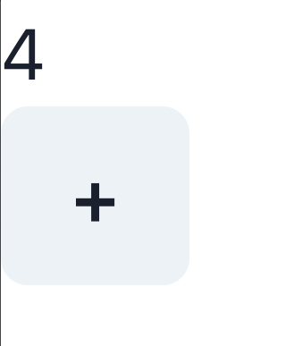
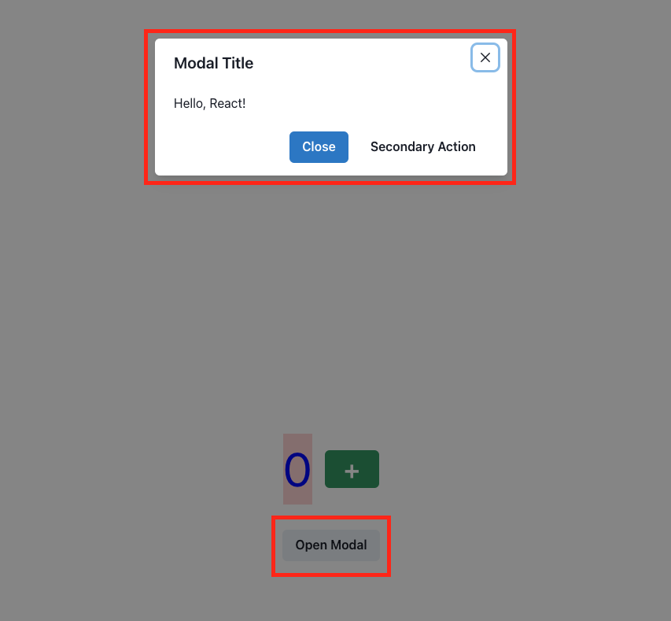
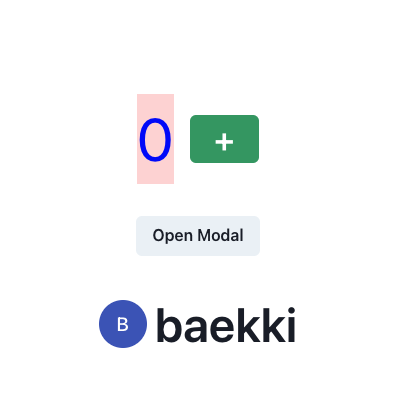

# chakra-ui

Chakra ui는 리액트에서 사용 할 수 있는 프레임워크입니다. 개발자들이 간편하게 UI를 구성할 수 있도록 도와주고 컴포넌트는 직관적이고, 필요할 때 쉽게 커스터마이징 할 수 있습니다.

https://v2.chakra-ui.com/getting-started/vite-guide

## 기본 셋팅

### Installation

> npm create vite@latest chakra-ui-practice -- --template react-ts

설치 후, chakra-ui-practice 폴더로 이동 후 npm install.

> npm i @chakra-ui/react @emotion/react @emotion/styled framer-motion

### Provider Setup

Chakra UI를 설치한 후 애플리케이션 루트에 ChakraProvider를 설정해야 합니다.

src 디렉터리로 이동하여 main.jsx 또는 main.tsx 내부에서 ChakraProvider를 감싸줍니다.

```typescript
// main.tsx

import React from "react";
import ReactDOM from "react-dom/client";
import App from "./App.tsx";
import { ChakraProvider } from "@chakra-ui/react";

ReactDOM.createRoot(document.getElementById("root")!).render(
  <React.StrictMode>
    <ChakraProvider>
      <App />
    </ChakraProvider>
  </React.StrictMode>
);
```

그리고 불필요한 파일들을 삭제해줍니다.

> index.css, asset폴더, public/svg파일 삭제.

## practice

### Box

```typescript
import { Box } from "@chakra-ui/react";
import { FC } from "react";

const App: FC = () => {
  return <Box>Hello, React!</Box>;
};

export default App;
```

위에서 Box태그는 div태그와 유사하다고 볼 수 있습니다. Chakra-ui를 사용한다면, 굳이 div를 사용하지 않습니다.

### Button

```typescript
import { Box, Button } from "@chakra-ui/react";
import { FC, useState } from "react";

const App: FC = () => {
  const [count, setCount] = useState<number>(0);

  return (
    <Box>
      <Box>{count}</Box>
      <Button onClick={() => setCount(count + 1)}>+</Button>
    </Box>
  );
};

export default App;
```



위 이미지에서 볼 수 있듯이, Button 태그의 디자인, hover, active 등 포함되어 있습니다.

아래 링크에서 다양한 속성들을 확인해보세요.

https://v2.chakra-ui.com/docs/components/button

버튼의 색상은 bgColor 속성을 이용해서 변경 할 수 있지만, hover, active는 기본 색상값이 정해져있습니다.

이를 수정하기 위해서는 colorScheme을 사용하시면 됩니다.

```typescript
import { Box, Button } from "@chakra-ui/react";
import { FC, useState } from "react";

const App: FC = () => {
  const [count, setCount] = useState<number>(0);

  return (
    <Box>
      <Box fontSize={60} bgColor={"red.100"} color={"blue.500"}>
        {count}
      </Box>
      <Button colorScheme="red" onClick={() => setCount(count + 1)}>
        +
      </Button>
    </Box>
  );
};

export default App;
```

위 처럼 colorScheme의 색상을 red로 지정하면, hover, active도 red와 유사한 색상으로 적용되어 편리합니다.

### display 속성

```typescript
import { Box, Button } from "@chakra-ui/react";
import { FC, useState } from "react";

const App: FC = () => {
  const [count, setCount] = useState<number>(0);

  return (
    <Box
      minH="100vh"
      display="flex"
      justifyContent="center"
      alignItems="center"
      gap={8}
    >
      <Box fontSize={60} bgColor={"red.100"} color={"blue.500"}>
        {count}
      </Box>
      <Button colorScheme="green" onClick={() => setCount(count + 1)}>
        +
      </Button>
    </Box>
  );
};

export default App;
```

가운데 정렬하고 싶을 때, flex를 적용했었습니다. 하지만, chakra-ui에는 Flex라는 컴포넌트가 있습니다.

```typescript
import { Box, Button, Flex } from "@chakra-ui/react";
import { FC, useState } from "react";

const App: FC = () => {
  const [count, setCount] = useState<number>(0);

  return (
    <Flex
      flexDir="column"
      minH="100vh"
      justifyContent="center"
      alignItems="center"
      gap={8}
    >
      <Flex gap={4} alignItems="center">
        <Box fontSize={60} bgColor="red.100" color="blue">
          {count}
        </Box>
        <Button
          size="lg"
          fontSize={32}
          colorScheme="green"
          onClick={() => setCount(count + 1)}
        >
          +
        </Button>
      </Flex>
    </Flex>
  );
};

export default App;
```

Flex라는 태그(컴포넌트)를 사용하시면 됩니다. Flex 속성 중 flexDir = flexDirection 동일합니다.

justifyContent, alignItems, minH, flexDir등 자주 사용하는 속성들은 잘 확인해두세요😃

### Count 컴포넌트 분리

```typescript
// App.tsx

import { Flex } from "@chakra-ui/react";
import { FC } from "react";
import Count from "./components/Count";

const App: FC = () => {
  return (
    <Flex
      flexDir="column"
      minH="100vh"
      justifyContent="center"
      alignItems="center"
      gap={8}
    >
      <Count />
    </Flex>
  );
};

export default App;
```

```typescript
// components/Count.tsx

import { Box, Button, Flex } from "@chakra-ui/react";
import { FC, useState } from "react";

const Count: FC = () => {
  const [count, setCount] = useState<number>(0);

  return (
    <Flex gap={4} alignItems="center">
      <Box fontSize={60} bgColor="red.100" color="blue">
        {count}
      </Box>
      <Button
        size="lg"
        fontSize={32}
        colorScheme="green"
        onClick={() => setCount(count + 1)}
      >
        +
      </Button>
    </Flex>
  );
};

export default Count;
```

### Modal

모달창을 사용해봅시다!

https://v2.chakra-ui.com/docs/components/modal

예제에서 fragment (<>) 태그로 감싸져 있는 부분을 활용하면 됩니다. App.tsx에 적용해볼까요?

```typescript
import {
  Button,
  Flex,
  Modal,
  ModalBody,
  ModalCloseButton,
  ModalContent,
  ModalFooter,
  ModalHeader,
  ModalOverlay,
  useDisclosure,
} from "@chakra-ui/react";
import { FC } from "react";
import Count from "./components/Count";

const App: FC = () => {
  const { isOpen, onOpen, onClose } = useDisclosure();

  return (
    <>
      <Flex
        flexDir="column"
        minH="100vh"
        justifyContent="center"
        alignItems="center"
        gap={8}
      >
        <Count />
        <Button onClick={onOpen}>Open Modal</Button>
      </Flex>

      <Modal isOpen={isOpen} onClose={onClose}>
        <ModalOverlay />
        <ModalContent>
          <ModalHeader>Modal Title</ModalHeader>
          <ModalCloseButton />
          <ModalBody>Hello, React!</ModalBody>

          <ModalFooter>
            <Button colorScheme="blue" mr={3} onClick={onClose}>
              Close
            </Button>
            <Button variant="ghost">Secondary Action</Button>
          </ModalFooter>
        </ModalContent>
      </Modal>
    </>
  );
};

export default App;
```



코드를 살펴보면,

> const { isOpen, onOpen, onClose } = useDisclosure();

isOpen, onOpen, onClose는 모달창의 상태를 나타냅니다. boolean 값으로 되어있습니다.

> ModalOverlay

ModalOverlay는 배경을 흐릿하게 해줍니다. 즉, 모달창이 팝업되었다는걸 인지하기 쉽게 도와줍니다.

⚠️ ModalOverlay에 bgColor 속성을 줄 수도 있습니다.

> ModalHeader

Modal창의 타이틀 부분입니다. 텍스트 입력해주시면 됩니다.

> ModalCloseButton

ModalCloseButton은 모달창 우측 상단의 'X' 버튼입니다.

> ModalBody

ModalBody는 모달창에 들어갈 타이틀 아래의 본문입니다.

> button의 variant 속성

hakra UI의 Button 컴포넌트에서 variant="ghost" 속성은 버튼의 스타일을 변경하는 역할을 합니다. ghost 변형은 버튼을 거의 보이지 않게 하면서도 버튼의 기본 기능을 유지하는 스타일을 적용합니다. 이는 특히 배경이나 컨텍스트에 매끄럽게 어울리는 버튼을 만들 때 유용합니다.

#### Modal component

modal을 컴포넌트로 분리해봅시다.

```typescript
// App.tsx

import { Button, Flex, useDisclosure } from "@chakra-ui/react";
import { FC } from "react";
import Count from "./components/Count";
import ModalComp from "./components/ModalComp";

const App: FC = () => {
  const { isOpen, onOpen, onClose } = useDisclosure();

  return (
    <>
      <Flex
        flexDir="column"
        minH="100vh"
        justifyContent="center"
        alignItems="center"
        gap={8}
      >
        <Count />
        <Button onClick={onOpen}>Open Modal</Button>
      </Flex>
      <ModalComp isOpen={isOpen} onClose={onClose} />
    </>
  );
};

export default App;
```

```typescript
// components/ModalComp.tsx

import {
  Button,
  Modal,
  ModalBody,
  ModalCloseButton,
  ModalContent,
  ModalFooter,
  ModalHeader,
  ModalOverlay,
} from "@chakra-ui/react";
import { FC } from "react";

interface ModalCompProps {
  isOpen: boolean;
  onClose: () => void;
}

const ModalComp: FC<ModalCompProps> = ({ isOpen, onClose }) => {
  return (
    <Modal isOpen={isOpen} onClose={onClose}>
      <ModalOverlay />
      <ModalContent>
        <ModalHeader>리액트를 잘하는 방법</ModalHeader>
        <ModalCloseButton />
        <ModalBody>Hello, React!</ModalBody>

        <ModalFooter>
          <Button colorScheme="blue" mr={3} onClick={onClose}>
            Close
          </Button>
          <Button variant="ghost">Secondary Action</Button>
        </ModalFooter>
      </ModalContent>
    </Modal>
  );
};

export default ModalComp;
```

isOpen과 onClose는 Props로 전달받아야 합니다. 따라서 interface로 타입을 정해주어야 합니다.

onClose의 타입은 마우스를 올려보면 `() => void` 타입인 것을 알 수 있습니다.

### Avatar

Chakra UI의 Avatar 컴포넌트는 사용자 프로필 이미지 또는 아이콘을 표시하는 데 사용됩니다. 이 컴포넌트는 다양한 스타일 옵션과 기능을 제공하여 사용자 인터페이스의 일관성과 미적인 요소를 쉽게 관리할 수 있게 해줍니다.

chakra-ui의 Avartar를 사용해봅시다.

먼저 Avartar 컴포넌트를 만들어주세요.

```typescript
// components/AvatarComp.tsx

import { Avatar, Flex, Text } from "@chakra-ui/react";
import { FC } from "react";

const nickName = "baekki";

const AvatarComp: FC = () => {
  return (
    <Flex>
      <Avatar name={nickName} />
      <Text fontSize={48} fontWeight="semibold">
        {nickName}
      </Text>
    </Flex>
  );
};

export default AvatarComp;
```

```typescript
// App.tsx

import { Button, Flex, useDisclosure } from "@chakra-ui/react";
import { FC } from "react";
import Count from "./components/Count";
import ModalComp from "./components/ModalComp";
import AvatarComp from "./components/AvatarComp";

const App: FC = () => {
  const { isOpen, onOpen, onClose } = useDisclosure();

  return (
    <>
      <Flex
        flexDir="column"
        minH="100vh"
        justifyContent="center"
        alignItems="center"
        gap={8}
      >
        <Count />
        <Button onClick={onOpen}>Open Modal</Button>
        <AvatarComp />
      </Flex>
      <ModalComp isOpen={isOpen} onClose={onClose} />
    </>
  );
};

export default App;
```



Avatar의 다양한 속성들로는 아래와 같습니다.

- src: 이미지 URL을 지정합니다.

> `<Avatar src="https://example.com/profile.jpg" />` 또는

> `src="/images/image.png"`

- name: 이미지가 로드되지 않을 경우 표시할 이름을 지정합니다. 이름의 이니셜이 표시됩니다.

> `<Avatar name="baekki" />`

- size: 아바타의 크기를 지정합니다. (2xs, xs, sm, md, lg, xl, 2xl, full)

> `<Avatar size="lg" />`

- borderRadius: 아바타의 모양을 조절합니다. (기본값: full)

> `<Avatar borderRadius="md" />`
