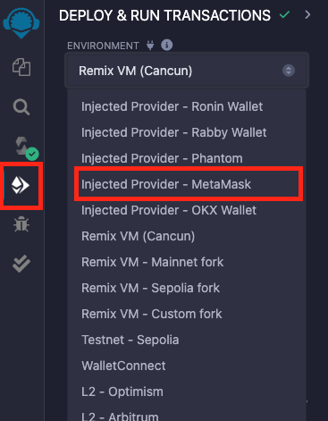
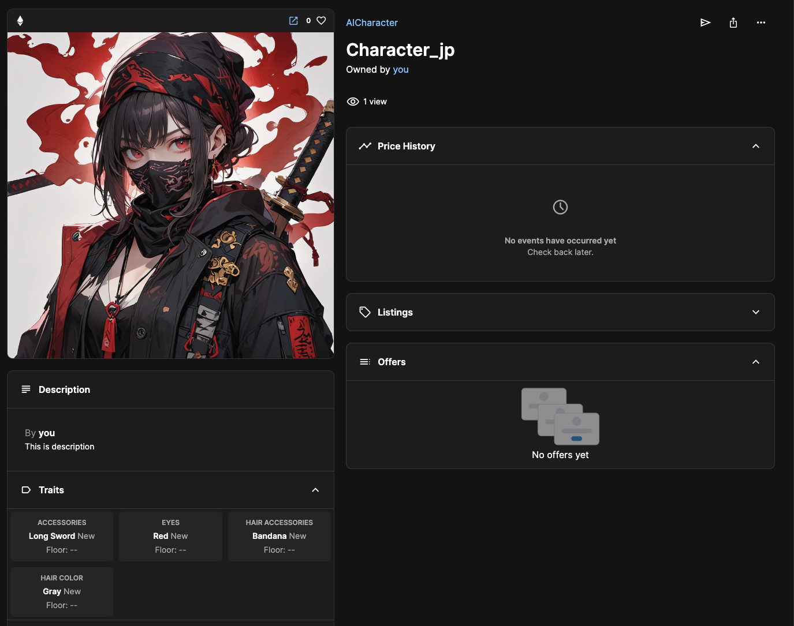

# NFT Contract

이번에는 Chakra-ui 를 사용해서 To-Do-List를 만들어봅시다!

## Remix ↔️ Localhost

- localhost 연결하기

> remixd -s . --remix-ide https://remix.ethereum.org

> https://remix.ethereum.org/

위 Remix IDE에 접속해서 WORKSPACES - localhost로 연결해주세요.

- MintNft.sol 파일 생성

## Contract

https://docs.openzeppelin.com/contracts/5.x/api/token/erc721

오픈재플린에서 ERC721에서 코드를 가져와봅시다.

### 상속, Constructor

```solidity
// MintNft.sol

// SPDX-License-Identifier: MIT
pragma solidity ^0.8.20;

import "@openzeppelin/contracts/token/ERC721/extensions/ERC721Enumerable.sol";

contract MintNft is ERC721Enumerable {

}
```

solidity 버전은 0.8.20이고, ERC721Enumerable을 임포트합니다.

contract 이름은 MintNft이고, ERC721Enumerable을 상속받아서 사용합니다.

위 까지만 작성하면 아래와 같은 오류가 발생합니다.

> TypeError: No arguments passed to the base constructor. Specify the arguments or mark "MintNft" as abstract.

ERC721Enumerable은 ERC721을 상속하고 있으며, ERC721 생성자는 두 개의 인자(name과 symbol)를 요구합니다.

오류의 원인은 ERC721Enumerable의 부모 계약인 ERC721의 생성자에게 필요한 인자를 전달하지 않았기 때문입니다.

따라서, 아래처럼 수정 할 수 있습니다.

```solidity
// SPDX-License-Identifier: MIT
pragma solidity ^0.8.20;

import "@openzeppelin/contracts/token/ERC721/extensions/ERC721Enumerable.sol";

contract MintNft is ERC721Enumerable {
    constructor(string memory _name, string memory _symbol) ERC721(_name, _symbol) { }
}
```

생성자(constructor)는 계약이 배포될 때 단 한 번 실행되는 특별한 함수입니다. 생성자는 주로 초기 설정 작업을 수행하거나 부모 계약의 생성자에게 필요한 인자를 전달하는 데 사용됩니다.

### metadataUri

```solidity
// SPDX-License-Identifier: MIT
pragma solidity ^0.8.20;

import "@openzeppelin/contracts/token/ERC721/extensions/ERC721Enumerable.sol";

contract MintNft is ERC721Enumerable {
    mapping(uint => string) metadataUri;

    constructor(string memory _name, string memory _symbol) ERC721(_name, _symbol) { }

    function mintNft() public {

    }
}
```

metadataUri 맵핑은 uint(nft의 토큰 id)는 => string(해당 토큰 id의 메타데이터) 입니다.

즉, metadataUri 매핑은 토큰 ID를 키로 하고 해당 토큰의 메타데이터 URI를 값으로 저장합니다.

### mintNft function

```solidity
// SPDX-License-Identifier: MIT
pragma solidity ^0.8.20;

import "@openzeppelin/contracts/token/ERC721/extensions/ERC721Enumerable.sol";

contract MintNft is ERC721Enumerable {
    mapping(uint => string) metadataUri;

    constructor(string memory _name, string memory _symbol) ERC721(_name, _symbol) {}

    function mintNft(string memory _metadataUri) public {
        uint tokenId = totalSupply() + 1;

        _mint(msg.sender, tokenId);

        metadataUri[tokenId] = _metadataUri;
    }
}
```

mintNft함수는 string형태의 \_metadataUri를 필요로 합니다.

tokenId는 현재 총 발행량 + 1로 정의합니다. 이유는 뭘까요? 이전에 100번까지 발행되었다면, 그 다음 발행할 tokenId는 101번이되어야 하기 때문입니다.

\_mint(msg.sender, tokenId)는 ERC721에 이미 있는 함수입니다.

https://docs.openzeppelin.com/contracts/5.x/api/token/erc721#ERC721-_mint-address-uint256-

\_mint함수는 address to, uint256 tokenId를 받는데, address는 msg.sender 즉, 내가 민팅한거니까 실행시킨 주체인 예약어를 사용했습니다.

그리고 metadataUri 맵핑에 해당 tokenId의 string값은 \_metadataUri입니다.

결론으로, mintNft 함수는 새로운 NFT를 민팅하고, 그 토큰 ID에 대해 메타데이터 URI를 저장합니다.

⚠️ public키워드는 visibility 관련 키워드입니다. public, private, internal, external 이 있는데 추후에 배웁니다 🙂

### tokenURI function

```solidity
// SPDX-License-Identifier: MIT
pragma solidity ^0.8.20;

import "@openzeppelin/contracts/token/ERC721/extensions/ERC721Enumerable.sol";

contract MintNft is ERC721Enumerable {
    mapping(uint => string) metadataUri;

    constructor(string memory _name, string memory _symbol) ERC721(_name, _symbol) {}

    function mintNft(string memory _metadataUri) public {
        uint tokenId = totalSupply() + 1;

        _mint(msg.sender, tokenId);

        metadataUri[tokenId] = _metadataUri;
    }

    function tokenURI(uint _tokenId) public view override returns (string memory) {
        return metadataUri[_tokenId];
    }
}
```

tokenURI 함수는 ERC721 표준에 정의된 함수로, 주어진 토큰 ID에 대한 메타데이터 URI를 반환합니다. 이 URI는 일반적으로 토큰의 메타데이터가 저장된 위치를 가리키며, 메타데이터는 토큰의 이름, 설명, 이미지, 속성 등을 포함할 수 있습니다.

tokenURI 함수는 public 접근 제어자를 사용하여 누구나 호출할 수 있도록 합니다.

view 키워드는 이 함수가 상태를 변경하지 않으며, 블록체인에 저장된 데이터를 읽기만 한다는 것을 나타냅니다.

override 키워드는 이 함수가 부모 계약 (ERC721)의 tokenURI 함수를 재정의한다는 것을 나타냅니다.

반환 타입은 string memory로, 토큰의 메타데이터 URI를 문자열로 반환합니다.

uint \_tokenId: 조회할 토큰의 ID를 나타냅니다.

return metadataUri[_tokenId];: 매개변수로 받은 \_tokenId를 사용하여 metadataUri 매핑에서 해당 토큰의 메타데이터 URI를 반환합니다.

### Deploy



Remix IDE에서 좌측 4번째, Deploy & run transactions 탭을 누르셔서, 상단에 ENVIRONMENT에서 metamask를 클릭해주세요.


\_name과 \_symbol을 적어주신 후 Deploy(배포) 해주시면 됩니다.

### IPFS

IPFS (InterPlanetary File System)는 탈중앙화 파일 저장 및 공유 시스템입니다. 기존의 HTTP 기반 웹이 중앙 서버를 통해 파일을 제공하는 것과 달리, IPFS는 P2P(peer-to-peer) 네트워크를 이용해 파일을 분산 저장하고 공유합니다.

IPFS서비스인 Pinata를 사용해봅시다.

https://www.pinata.cloud/

위 웹사이트에서 로그인해주세요.


Upload에서 File을 눌러 사용할 이미지 파일을 업로드해주세요.

그리고 업로드 한 이미지파일을 클릭해서, 이미지 주소를 확인해보세요.

예시) `https://blue-ready-marmot-67.mypinata.cloud/ipfs/QmXEANmZSkRAecrHoKeg9hTh414WxeGfsLPYpCVxAX1Q7t`

이제 해당 이미지의 메타데이터(속성)를 작성해봅시다!

### Metadata

VS Code에서 1.json 파일을 하나 만들어주세요.

메타데이터는 원하는대로 작성해주면 되지만, 오픈씨의 메타데이터 표준이 많이 쓰입니다.

https://docs.opensea.io/docs/metadata-standards

메타데이터를 작성해줍니다. 아래는 예시 메타데이터고, 자신의 이미지 메타데이터에 맞게 수정하시면 됩니다.

image 값에는 pinata에 업로드한 이미지의 주소를 넣어주시면 됩니다.

```json
{
  "name": "Character_jp",
  "description": "This is description",
  "image": "https://blue-ready-marmot-67.mypinata.cloud/ipfs/QmXEANmZSkRAecrHoKeg9hTh414WxeGfsLPYpCVxAX1Q7t",
  "attributes": [
    {
      "trait_type": "Hair color",
      "value": "Gray"
    },
    {
      "trait_type": "Eyes",
      "value": "Red"
    },
    {
      "trait_type": "Hair Accessories",
      "value": "Bandana"
    },
    {
      "trait_type": "Accessories",
      "value": "long sword"
    }
  ]
}
```

위 처럼 메타데이터 작성했다면 메타데이터 파일도 pinata에 업로드 합니다.

업로드 후 나온 메타데이터의 주소를 복사해두세요!

### Mint


mintNft function에 메타데이터의 주소를 넣어주신 후 mintNft를 실행하면 됩니다!

⚠️ 네트워크가 테스트넷인지 확인하시고, mintNft 에는 메타데이터 주소가 들어가야합니다! 이미지 주소가 아닙니다.

민팅이 되었다면 opensea testnet에서 확인해봅시다.

https://testnets.opensea.io

위에 접속하셔서 지갑을 로그인하시면, Profile에서 내가 만든 NFT를 확인 할 수 있습니다.



이미지가 바로 안나올 수 있으니 조금 기다려주시거나, 우측에 ...(more) 버튼을 눌러 Refresh metadata를 해주세요.

그리고 좌측 하단에 Description, Traits 등을 확인 할 수 있습니다. 메타데이터에 작성했던 것들입니다.

동일한 방법으로 2개 더 만들어보세요 😃

만드셨다면, 오픈씨 컬렉션을 공유해주세요😁

https://testnets.opensea.io/collection/aicharacter-1

‼️ 추가로 오픈씨 컬렉션을 꾸미는 방법은 컬렉션 우측에 Edit collection을 클릭하셔서 수정하시면 됩니다.


### Ownable

https://docs.openzeppelin.com/contracts/5.x/api/access#Ownable

Ownable에는 Modifiers로 onlyOwner() 함수가 있습니다. 이름에서 알 수 있듯이, 컨트렉트의 주인인지 확인 할 수 있는 함수입니다.

그럼 constructor에 Ownable(msg.sender)를 붙여주면, msg.sender가 Owner겠죠?

```solidity
// SPDX-License-Identifier: MIT
pragma solidity ^0.8.20;

import "@openzeppelin/contracts/token/ERC721/extensions/ERC721Enumerable.sol";
import "@openzeppelin/contracts/access/Ownable.sol";

contract MintNft is ERC721Enumerable, Ownable {
    mapping(uint => string) metadataUri;

    constructor(string memory _name, string memory _symbol) ERC721(_name, _symbol) Ownable(msg.sender) {}

    function mintNft(string memory _metadataUri) public {
        uint tokenId = totalSupply() + 1;

        _mint(msg.sender, tokenId);

        metadataUri[tokenId] = _metadataUri;
    }

    function tokenURI(uint _tokenId) public view override returns (string memory) {
        return metadataUri[_tokenId];
    }
}
```

Ownable도 상속받아서 사용합니다.

```solidity
// SPDX-License-Identifier: MIT
pragma solidity ^0.8.20;

import "@openzeppelin/contracts/token/ERC721/extensions/ERC721Enumerable.sol";
import "@openzeppelin/contracts/access/Ownable.sol";

contract MintNft is ERC721Enumerable, Ownable {
    mapping(uint => string) metadataUri;

    constructor(string memory _name, string memory _symbol) ERC721(_name, _symbol) Ownable(msg.sender) {}

    function mintNft(string memory _metadataUri) public onlyOwner {
        uint tokenId = totalSupply() + 1;

        _mint(msg.sender, tokenId);

        metadataUri[tokenId] = _metadataUri;
    }

    function tokenURI(uint _tokenId) public view override returns (string memory) {
        return metadataUri[_tokenId];
    }
}
```

mintNft 함수에 onlyOwner modifer를 추가해서 이제 해당 함수는 owner만 가능합니다.

컨트렉트를 새로 배포하고 다른 계정으로 mintNft 함수를 실행하려 해보면 실행되지 않습니다.

### Payable

payable 키워드를 통해 특정 함수나 생성자(constructor)가 이더리움을 수신할 수 있도록 허용할 수 있습니다. 이를 통해 스마트 계약에서 이더리움의 입출금이 가능해집니다.

```solidity
// SPDX-License-Identifier: MIT
pragma solidity ^0.8.20;

import "@openzeppelin/contracts/token/ERC721/extensions/ERC721Enumerable.sol";

contract MintNft is ERC721Enumerable {
    mapping(uint => string) metadataUri;

    constructor(string memory _name, string memory _symbol) ERC721(_name, _symbol) {}

    function mintNft(string memory _metadataUri) public payable {

        require(msg.value >= 0.01 ether, "Not enough ETH");

        uint tokenId = totalSupply() + 1;

        _mint(msg.sender, tokenId);

        metadataUri[tokenId] = _metadataUri;
    }

    function tokenURI(uint _tokenId) public view override returns (string memory) {
        return metadataUri[_tokenId];
    }
}
```

mintNft 함수에 payable 키워드를 사용해서 해당 함수를 실행하면 컨트렉트가 돈을 받게됩니다.

require는 안에 조건이 true일 경우 이후 코드를 실행합니다. false일경우 "Not enough ETH"메세지를 출력합니다.

msg.value는 sender가 보내는 이더리움의 양입니다. ether라는 키워드를 붙여서 ether단위이고, 키워드를 안붙이면 wei단위 입니다.

그럼 컨트랙트가 아닌, 특정 지갑으로 돈을 보내게 하려면 어떻게 해야될까요?

```solidity
// SPDX-License-Identifier: MIT
pragma solidity ^0.8.20;

import "@openzeppelin/contracts/token/ERC721/extensions/ERC721Enumerable.sol";

contract MintNft is ERC721Enumerable {
    mapping(uint => string) metadataUri;

    constructor(string memory _name, string memory _symbol) ERC721(_name, _symbol) {}

    function mintNft(string memory _metadataUri) public payable {
        require(msg.value >= 0.01 ether, "Not enough ETH.");

        uint tokenId = totalSupply() + 1;

        _mint(msg.sender, tokenId);

        metadataUri[tokenId] = _metadataUri;

        payable("받을 지갑 주소").transfer(msg.value);
    }

    function tokenURI(uint _tokenId) public view override returns (string memory) {
        return metadataUri[_tokenId];
    }
}
```

payable에 받을 지갑주소를 정해주시면 됩니다.
