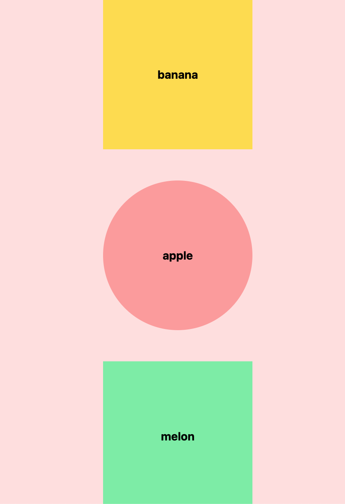
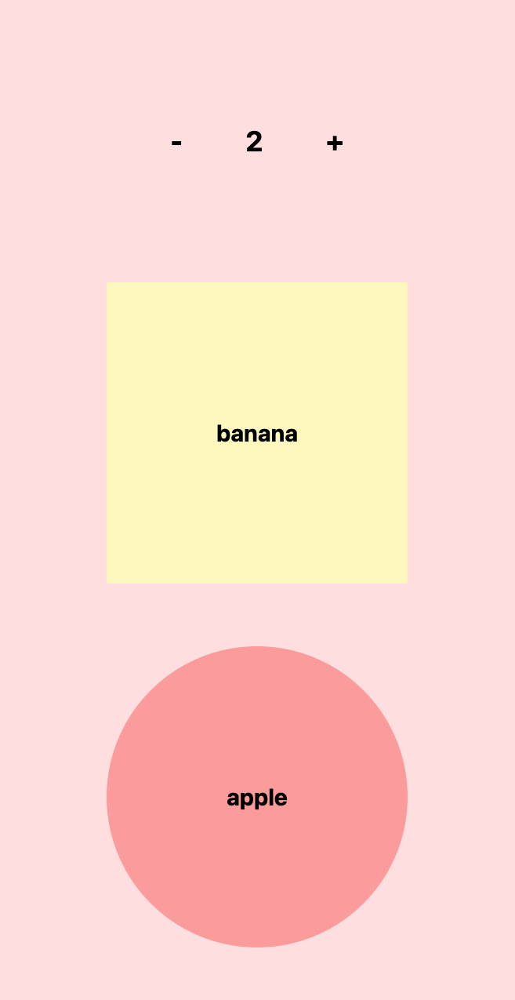

# React + Typescript

## 기본 세팅

### tempalte

> npm create vite@latest . -- --template react-ts

> npm install

### install tawildins css

> npm install -D tailwindcss postcss autoprefixer

> npx tailwindcss init -p

- tailwind.config.js 교체

```javascript
/** @type {import('tailwindcss').Config} */
export default {
  content: ["./index.html", "./src/**/*.{js,ts,jsx,tsx}"],
  theme: {
    extend: {},
  },
  plugins: [],
};
```

### index.css 교체

```css
@tailwind base;
@tailwind components;
@tailwind utilities;
```

### App.css, asset 삭제, public 하위 파일 삭제

## 함수형 컴포넌트

```typescript
// App.tsx

import { FC } from "react";

const App: FC = () => {
  return <div className="bg-red-100">Hello, ReactTS!</div>;
};

export default App;
```

함수형 컴포넌트는(Functional Component) React 컴포넌트를 정의하는 함수로, 간단하고 상태 관리가 필요 없는 컴포넌트를 작성할 때 주로 사용됩니다.

## props

그럼 props의 타입은 어떻게 정의할까요?

아래 Box.tsx 컴포넌트를 만들어주시고, 예제로 확인해 보겠습니다.

```typescript
// src/components/Box.tsx

import { FC } from "react";

const Box: FC<{ name: string; bgColor: string; isRounded: boolean }> = ({
  name,
  bgColor,
  isRounded,
}) => {
  return (
    <div
      className={`${bgColor} ${
        isRounded && "rounded-full"
      } w-96 h-96 text-3xl font-bold`}
    >
      {name}
    </div>
  );
};

export default Box;
```

컴포넌트 타입인 FC는 컴포넌트 옆에 바로 작성하고, props로 받는 것들의 타입은 제네릭 형태로 작성하면 됩니다.

위 형태를 인터페이스로 작성해봅시다!

```typescript
// src/components/Box.tsx

import { FC } from "react";

interface BoxProps {
  name: string;
  bgColor: string;
  isRounded: boolean;
}

const Box: FC<BoxProps> = ({ name, bgColor, isRounded }) => {
  return (
    <div
      className={`${bgColor} ${
        isRounded && "rounded-full"
      } w-96 h-96 text-3xl font-bold flex justify-center items-center`}
    >
      {name}
    </div>
  );
};

export default Box;
```

App.tsx도 작성해서 결과물을 확인해 봅시다!

```typescript
// App.tsx

import { FC } from "react";
import Box from "./components/Box";

const App: FC = () => {
  return (
    <div className="bg-red-100 min-h-screen flex flex-col justify-center items-center gap-20">
      <Box name="banana" bgColor="bg-yellow-300" isRounded={false} />
      <Box name="apple" bgColor="bg-red-300" isRounded={true} />
      <Box name="melon" bgColor="bg-green-300" isRounded={false} />
    </div>
  );
};

export default App;
```

```typescript
// src/components/Box.tsx

import { FC } from "react";

interface BoxProps {
  name: string;
  bgColor: string;
  isRounded: boolean;
}

const Box: FC<BoxProps> = ({ name, bgColor, isRounded }) => {
  return (
    <div
      className={`${bgColor} ${
        isRounded && "rounded-full"
      } w-96 h-96 text-3xl font-bold flex justify-center items-center`}
    >
      {name}
    </div>
  );
};

export default Box;
```

아래 이미지와 같은 결과를 확인 할 수 있습니다.



Box 컴포넌트에서 isRounded를 기본 false값을 주고 싶다면 아래와 같이 수정 할 수 있습니다.

```typescript
// src/components/Box.tsx

import { FC } from "react";

interface BoxProps {
  name: string;
  bgColor: string;
  isRounded?: boolean;
}

const Box: FC<BoxProps> = ({ name, bgColor, isRounded = false }) => {
  return (
    <div
      className={`${bgColor} ${
        isRounded && "rounded-full"
      } w-96 h-96 text-3xl font-bold flex justify-center items-center`}
    >
      {name}
    </div>
  );
};

export default Box;
```

```typescript
// App.tsx

import { FC } from "react";
import Box from "./components/Box";

const App: FC = () => {
  return (
    <div className="bg-red-100 min-h-screen flex flex-col justify-center items-center gap-20">
      <Box name="banana" bgColor="bg-yellow-100" isRounded={false} />
      <Box name="apple" bgColor="bg-red-300" isRounded={true} />
      <Box name="melon" bgColor="bg-green-300" isRounded={false} />
      <Box name="mango" bgColor="bg-yellow-300" />
      <Box name="grape" bgColor="bg-purple-500" />
    </div>
  );
};

export default App;
```

위 처럼 isRouned는 필수값으로 타입을 정하지 않고, 기본 값으로 false를 적용 할 수 있습니다.

이제 count예제도 만들어봅시다.

```typescript
// App.tsx

import { FC, useState } from "react";
import Box from "./components/Box";

const App: FC = () => {
  const [count, setCount] = useState<number>(0);

  return (
    <div className="bg-red-100 min-h-screen flex flex-col justify-center items-center gap-20">
      <Box name="banana" bgColor="bg-yellow-100" isRounded={false} />
      <Box name="apple" bgColor="bg-red-300" isRounded={true} />
      <Box name="melon" bgColor="bg-green-300" isRounded={false} />
      <Box name="mango" bgColor="bg-yellow-300" />
      <Box name="grape" bgColor="bg-purple-500" />
    </div>
  );
};

export default App;
```

useState 훅을 사용하는 기본 방법은 다음과 같습니다.

> const [state, setState] = useState<타입>(초기값);

위 문법에서 타입 부분에 제네릭 타입을 지정하고, 초기값 부분에 상태 변수의 초기값을 설정합니다.

```typescript
// App.tsx

import { FC, useState } from "react";
import Box from "./components/Box";

const App: FC = () => {
  const [count, setCount] = useState<number>(0);

  return (
    <>
      <div className="bg-red-100 flex justify-center items-center gap-20 py-40 font-bold text-4xl">
        <button onClick={() => setCount(count - 1)}>-</button>
        {count}
        <button onClick={() => setCount(count + 1)}>+</button>
      </div>
      <div className="bg-red-100 min-h-screen flex flex-col justify-center items-center gap-20">
        <Box name="banana" bgColor="bg-yellow-100" isRounded={false} />
        <Box name="apple" bgColor="bg-red-300" isRounded={true} />
        <Box name="melon" bgColor="bg-green-300" isRounded={false} />
        <Box name="mango" bgColor="bg-yellow-300" />
        <Box name="grape" bgColor="bg-purple-500" />
      </div>
    </>
  );
};

export default App;
```

위 코드를 실행하면 아래와 같고, count가 실행되는 것을 확인 할 수 있습니다.


