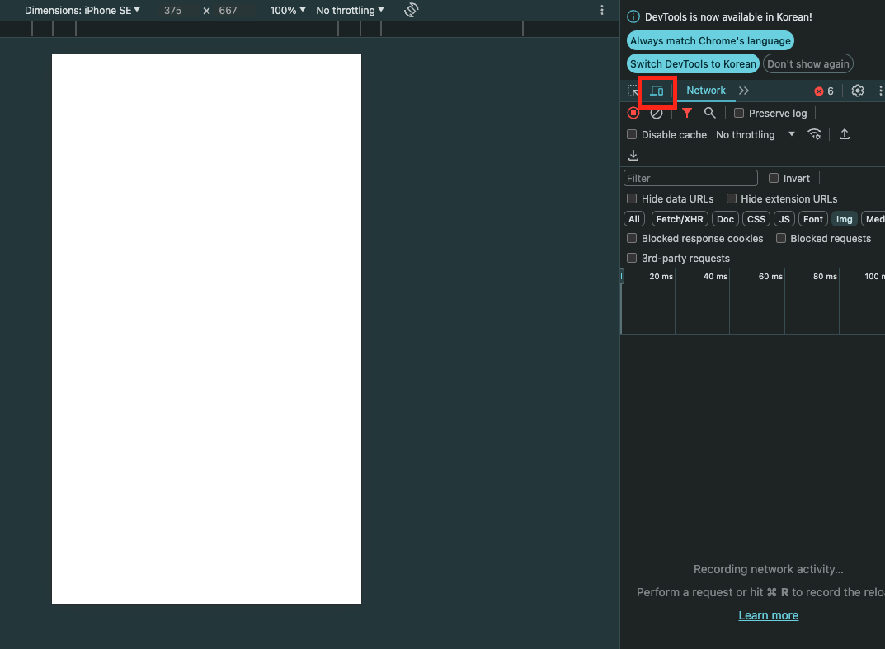
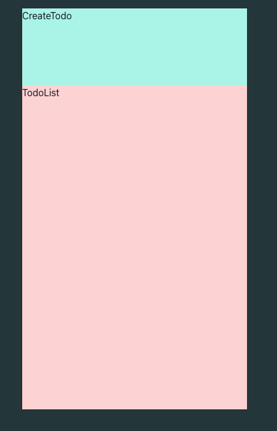
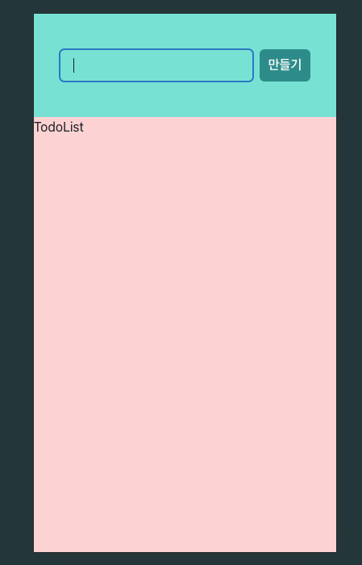
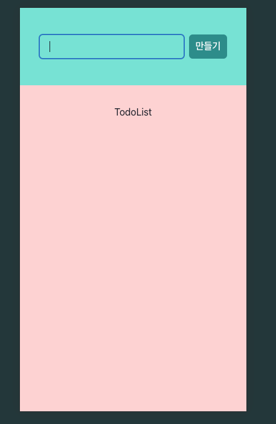
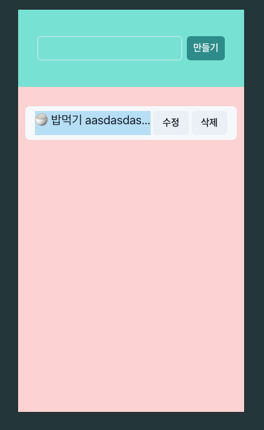
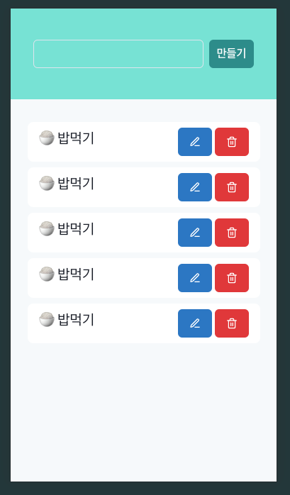
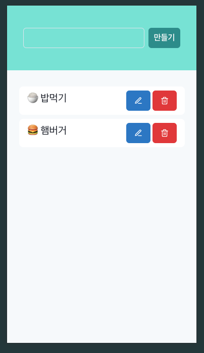

# To Do List

이번에는 Chakra-ui 를 사용해서 To-Do-List를 만들어봅시다!

## 기본 셋팅

### Installation

> npm create vite@latest . -- --template react-ts

> npm install

> npm i @chakra-ui/react @emotion/react @emotion/styled framer-motion

```typescript
import React from "react";
import ReactDOM from "react-dom/client";
import App from "./App.tsx";
import { ChakraProvider } from "@chakra-ui/react";

ReactDOM.createRoot(document.getElementById("root")!).render(
  <React.StrictMode>
    <ChakraProvider>
      <App />
    </ChakraProvider>
  </React.StrictMode>
);
```

디자인 먼저 작성할 건데, 모바일 사이즈로 작성해보죠!

> npm run dev

개발자 도구를 열어서 모바일 사이즈로 확인해보면서 합시다!



## 컴포넌트 (CreateTodo.tsx, TodoList.tsx)

아래와 같이 CreateTodo.tsx, TodoList.tsx 컴포넌트를 만들어주고 임포트 합니다.

```typescript
import { Flex } from "@chakra-ui/react";
import { FC } from "react";
import CreateTodo from "./components/CreateTodo";
import TodoList from "./components/TodoList";

const App: FC = () => {
  return (
    <Flex flexDir="column" minH="100vh">
      <CreateTodo />
      <TodoList />
    </Flex>
  );
};

export default App;
```

```typescript
// components/CreateTodo.tsx

import { Box } from "@chakra-ui/react";
import { FC } from "react";

const CreateTodo: FC = () => {
  return (
    <Box bgColor="teal.100" h={32}>
      CreateTodo
    </Box>
  );
};

export default CreateTodo;
```

```typescript
// components/TodoList.tsx

import { Box } from "@chakra-ui/react";
import { FC } from "react";

const TodoList: FC = () => {
  return (
    <Box bgColor="red.100" flexGrow={1}>
      TodoList
    </Box>
  );
};

export default TodoList;
```

위 코드를 실행하면 아래와 같은 이미지를 확인 할 수 있습니다.



그럼 버튼을 만들어볼까요?

```typescript
// components/CreateTodo.tsx

import { Button, Flex, Input } from "@chakra-ui/react";
import { FC } from "react";

const CreateTodo: FC = () => {
  return (
    <Flex
      px={8}
      bgColor="teal.200"
      h={32}
      justifyContent="center"
      alignItems="center"
    >
      <Input />
      <Button ml={2} colorScheme="teal">
        만들기
      </Button>
    </Flex>
  );
};

export default CreateTodo;
```

Box태그를 Flex로 변경 후, 가운데 정렬 해줍니다.

그리고 Input 태그와 Button태그를 작성해줍니다.



그럼 위 이미지처럼 Input 박스와, 만들기 버튼이 생겼습니다!

TodoList.tsx도 아래와 같이 정렬해줍니다.

```typescript
// components/TodoList.tsx

import { Flex } from "@chakra-ui/react";
import { FC } from "react";

const TodoList: FC = () => {
  return (
    <Flex
      bgColor="red.100"
      flexGrow={1}
      flexDir="column"
      alignItems="center"
      pt={8}
    >
      TodoList
    </Flex>
  );
};

export default TodoList;
```



## 컴포넌트 (TodoCard.tsx)

TodoCard.tsx 컴포넌트를 만들어줍니다.

```typescript
import { Button } from "@chakra-ui/button";
import { Flex, Text } from "@chakra-ui/layout";
import { FC } from "react";

const TodoCard: FC = () => {
  return (
    <Flex bgColor="gray.50" px={4} py={2} rounded="lg" gap={1}>
      <Text fontSize={20} bgColor="blue.100" w={48} isTruncated={true}>
        🍚 밥먹기
        aasdasdasdasdadasdasdasdasdasdasdasdasdasdasdasdadasdadasdadasdadassd
      </Text>
      <Button>수정</Button>
      <Button>삭제</Button>
    </Flex>
  );
};

export default TodoCard;
```

Text 속성 중 isTruncated는 글자수가 넓이인 w={48}을 넘어간다면, ... 으로 처리합니다.

그리고 TodoList에서 임포트 합니다.

```typescript
// components/TodoList.tsx

import { Flex } from "@chakra-ui/react";
import { FC } from "react";
import TodoCard from "./Todocard";

const TodoList: FC = () => {
  return (
    <Flex
      bgColor="red.100"
      flexGrow={1}
      flexDir="column"
      alignItems="center"
      pt={8}
    >
      <TodoCard />
    </Flex>
  );
};

export default TodoList;
```



### react-icons

> npm install react-icons --save

react-icons 설치 후 원하는 아이콘을 골라서 임포트 해줍니다.

https://react-icons.github.io/react-icons/

```typescript
// components/TodoCard.tsx

import { Button, Flex, Text } from "@chakra-ui/react";
import { FC } from "react";
import { FiEdit3, FiTrash2 } from "react-icons/fi";

const TodoCard: FC = () => {
  return (
    <Flex bgColor="white" px={4} py={2} rounded="lg" gap={1}>
      <Text fontSize={20} w={48} isTruncated={true}>
        🍚 밥먹기
      </Text>
      <Button colorScheme="blue">
        <FiEdit3 />
      </Button>
      <Button colorScheme="red">
        <FiTrash2 />
      </Button>
    </Flex>
  );
};

export default TodoCard;
```

위 코드를 TodoList.tsx 컴포넌트에 여러개 삽입해봅시다.

```typescript
import { Flex } from "@chakra-ui/react";
import { FC } from "react";
import TodoCard from "./TodoCard";

const TodoList: FC = () => {
  return (
    <Flex
      bgColor="gray.50"
      flexGrow={1}
      flexDir="column"
      alignItems="center"
      pt={8}
      gap={2}
    >
      <TodoCard />
      <TodoCard />
      <TodoCard />
      <TodoCard />
      <TodoCard />
    </Flex>
  );
};

export default TodoList;
```

그럼 아래와 같은 결과를 볼 수 있습니다.



## CRUD

이제 Todo 생성(Create), 읽기(Read), 수정(Update), 삭제(Delete)를 구현해봅시다.

먼저 Todo에서 사용 할 타입을 인터페이스로 만들어봅시다.

src폴더 하위에 index.d.ts 파일을 만들어 주세요.

index.d.ts 파일은 TypeScript 프로젝트에서 주로 타입 선언을 저장하는 데 사용되는 파일입니다. 이 파일은 프로젝트 내의 타입 정의를 중앙에서 관리하고, 다른 파일에서 사용할 수 있도록 하기 위해 존재합니다.

```typescript
// src/index.d.ts

interface ITodo {
  id: number;
  content: string;
  isDone: boolean;
}
```

```typescript
import { Flex } from "@chakra-ui/react";
import { FC, useState } from "react";
import CreateTodo from "./components/CreateTodo";
import TodoList from "./components/TodoList";

const sampleData: ITodo[] = [
  {
    id: 1,
    content: "🍚 밥먹기",
    isDone: false,
  },
  {
    id: 2,
    content: "🍔 햄버거",
    isDone: false,
  },
];

const App: FC = () => {
  const [todos, setTodos] = useState<ITodo[]>(sampleData);

  return (
    <Flex flexDir="column" minH="100vh">
      <CreateTodo />
      <TodoList todos={todos} />
    </Flex>
  );
};

export default App;
```

위 코드는 todos에서 에러가 발생합니다.

TodoList에 props를 받아야 하는데 타입이 정의되어 있지 않기 때문입니다.

따라서 TodoList에 타입을 정의해줍시다.

```typescript
import { Flex } from "@chakra-ui/react";
import { FC } from "react";
import TodoCard from "./TodoCard";

interface TodoList {
  todos: ITodo[];
}

const TodoList: FC<TodoList> = ({ todos }) => {
  return (
    <Flex
      bgColor="gray.50"
      flexGrow={1}
      flexDir="column"
      alignItems="center"
      pt={8}
      gap={2}
    >
      {todos.map((v) => (
        <TodoCard />
      ))}
    </Flex>
  );
};

export default TodoList;
```

TodoList 컴포넌트에서 받은 todos의 타입은 ITodo 타입으로 정의합니다.

그리고 index.d.ts에서 ITodo의 타입에서 id: number값이 있기 때문에, map함수에 key 값으로 사용했던 (i)는 없어도 됩니다.

하지만 아직 TodoCard에 데이터(v)를 전달하지 않았습니다. 전달해주고 랜더링해봅시다!

```typescript
// components/TodoList.tsx

import { Flex } from "@chakra-ui/react";
import { FC } from "react";
import TodoCard from "./TodoCard";

interface TodoList {
  todos: ITodo[];
}

const TodoList: FC<TodoList> = ({ todos }) => {
  return (
    <Flex
      bgColor="gray.50"
      flexGrow={1}
      flexDir="column"
      alignItems="center"
      pt={8}
      gap={2}
    >
      {todos.map((v) => (
        <TodoCard key={v.id} todo={v} />
      ))}
    </Flex>
  );
};

export default TodoList;
```

TodoCard에도 내려줬으니, TodoCard에서도 타입을 정의해줍시다.

```typescript
// components/TodoCard.tsx

import { Button, Flex, Text } from "@chakra-ui/react";
import { FC } from "react";
import { FiEdit3, FiTrash2 } from "react-icons/fi";

interface TodoCard {
  todo: ITodo;
}

const TodoCard: FC<TodoCard> = ({ todo }) => {
  return (
    <Flex bgColor="white" px={4} py={2} rounded="lg" gap={1}>
      <Text fontSize={20} w={48} isTruncated={true}>
        {todo.content}
      </Text>
      <Button colorScheme="blue">
        <FiEdit3 />
      </Button>
      <Button colorScheme="red">
        <FiTrash2 />
      </Button>
    </Flex>
  );
};

export default TodoCard;
```

이제 받아온 todo의 content로 나타낼 수 있습니다.



### 생성 (Create)

이제 sampleData에서 가져오는게 아닌, 데이터 생성이 되도록 해봅시다.

그리고 todos, setTodos도 CreateTodo에 props로 전달합니다.

```typescript
import { Flex } from "@chakra-ui/react";
import { FC, useState } from "react";
import CreateTodo from "./components/CreateTodo";
import TodoList from "./components/TodoList";

const sampleData: ITodo[] = [
  {
    id: 1,
    content: "🍚 밥먹기",
    isDone: false,
  },
  {
    id: 2,
    content: "🍔 햄버거",
    isDone: false,
  },
  {
    id: 3,
    content: "🍕 피자",
    isDone: false,
  },
];

const App: FC = () => {
  const [todos, setTodos] = useState<ITodo[]>(sampleData);

  return (
    <Flex flexDir="column" minH="100vh">
      <CreateTodo todos={todos} setTodos={setTodos} />
      <TodoList todos={todos} />
    </Flex>
  );
};

export default App;
```

```typescript
// components/CreateTodo.tsx

import { Button, Flex, Input } from "@chakra-ui/react";
import { Dispatch, FC, SetStateAction } from "react";

interface CreateTodoProps {
  todos: ITodo[];
  setTodos: Dispatch<SetStateAction<ITodo[]>>;
}

const CreateTodo: FC = () => {
  return (
    <Flex
      px={8}
      bgColor="teal.200"
      h={32}
      justifyContent="center"
      alignItems="center"
    >
      <Input />
      <Button ml={2} colorScheme="teal">
        만들기
      </Button>
    </Flex>
  );
};

export default CreateTodo;
```

CreateTodoProps의 setTodos 타입은 setTodos에 마우스를 올려보시면 이중제네릭으로 타입이 확인가능합니다.

그럼 CreateTodo에서 타입을 정의했으니 props를 받아볼까요?

```typescript
// components/CreateTodo.tsx

import { Button, Flex, Input } from "@chakra-ui/react";
import { Dispatch, FC, SetStateAction, useState } from "react";

interface CreateTodoProps {
  todos: ITodo[];
  setTodos: Dispatch<SetStateAction<ITodo[]>>;
}

const CreateTodo: FC<CreateTodoProps> = ({ todos, setTodos }) => {
  const [currentTodoId, setCurrentTodoId] = useState<number>(
    todos[todos.length - 1].id
  );

  return (
    <Flex
      px={8}
      bgColor="teal.200"
      h={32}
      justifyContent="center"
      alignItems="center"
    >
      <Input />
      <Button ml={2} colorScheme="teal">
        만들기
      </Button>
    </Flex>
  );
};

export default CreateTodo;
```

생성할 때, content뿐만 아니라 id값도 필요하기 때문에 현재 id값을 알 수 있는 currentTodoId useState훅도 하나 만들어줍니다.
